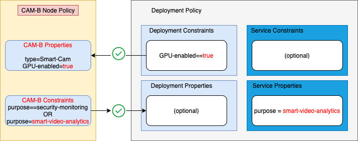

# IEAM Policy Tour Demo
[box note](https://ibm.ent.box.com/notes/666476284832?s=1q9a1d3xdx8unh65k6vm10n8lvg2slmg)

[demo environment](https://cloudcontent.mybluemix.net/cloud/garage/dte/producttour/ibm-edge-application-manager-workload-management)


<dl>
  <dt>Videos</dt>
  <dd>IBM Edge Computing demo.</dd>
<a href="http://www.youtube.com/watch?feature=player_embedded&v=bmxV5w8DJ8c
" target="_blank"></a>
</dl>

## 1. Introductions

Hello, I am ____`<your-name>`____ wtih the **IBM Edge Application Manager** (IEAM) team.

We're going to take you through a demo of IBM Edge Application Manager. 

IEAM provides a highly secure and robust application life-cycle management for literally thousands of edge machines regardless of their hardware and software differences. Our fully autonomous Agents transparently work through firewalls, and allows for continuous operation even when the local network is disrupted, making application deployment both time and cost efficient.


Let's take a look at how our **policy deployment** feature autonomously controls workload installation and update for devices with differing capabilities in a retail environment. 

We're going to use ACME Grocery -- a fictional nationwide grocery chain. Each store has a variety of cameras arrayed in various positions throughout their stores, and they want to use them to monitor for security issues as well as for potential inventory outages.  

See diagram below:


We're going to demonstrate this scenario using a live IEAM management hub.

Let's take a look at the IBM Edge Application Manager (**IEAM**) dashboard for ACME's cameras:

* Go to the IEAM dashboard mock-up

	[Management Hub](http://icp.com/edge)
	

## 2. IEAM Management Hub
The **dashboard** resides in the your **Management Hub** which can be placed wherever appropriate (for example, in a public cloud, or a regional data center, or even inside a factory, completely air-gapped from the Internet).

The **dashboard** enables you to see and interact with all of your edge assets in one place, regardless of their physical locations or current connection status. These edge machines may be geographically distributed or concentrated in one location. The **Agents** on these edge machines are fully autonomous, are able to reach out to the Management Hub through firewalls when needed. They also tolerate unreliable and intermittent connectivity to the Management Hub.


Notice the dashboard has 4 tabs: **Nodes**, **Services**, **Patterns** and **Policies**. Let's take a look at the **Nodes** tab first:

* Go to the `Nodes` tab

	[Management Hub](http://icp.com/edge)
	
The **Nodes** represent your edge machines. Here you can view and interact with your nodes. It will show all of you registered devices, their assigned software and their last reported status.


What you are looking at now is **graphical** node summary.


You can also view your edge nodes as a **list**.

* Go to the `List` view:

	[Management Hub](http://icp.com/edge)

The **list** view shows additional details that are not visible in a graph layout, like **node owner** and last **heartbeat**. If you select an individual node in the list view you can see even more details.

* Go to the **ACME DEV** node

	

Notice **ACME DEV's** current configuration of **properties** and **constraints**. 
These **properties** and **constraints** comprise this node's **policy**, and enable this node to identify its capabilities and highlight its differences. When combined with other policies, it will also inform the type of workloads it will run.

Notice no edge services are running on the Dev node.

* Optional

	Register **CAM-A** and **CAM-B** nodes using the `CLI` command:

	`hzn register` 

	on each of the two CAM nodes VMs
	
Next, let's explore **CAM-A** settings:

## 2.1 CAM-A Details

* Go to the **CAM-A** node

	[Management Hub](http://icp.com/edge)

Notice **CAM-A's** current configuration of **properties** and **constraints**. 
These **properties** and **constraints** comprise this node's **policy**, and enable this node to identify its capabilities and highlight its differences. When combined with other policies, it will also inform the type of workloads it will run.


Review (or update( the **properties** of **CAM-A** as:

`type=Security-Cam` 

and 

`GPU-enabled=false`

The latter is used here to indicate that this camera does not contain a video processing accelerator. This camera will only be able to run simple security workloads, and not video analytic workloads. 

**CAM-Av also states a **constraint** that it will only accept software deployment policies that specify the  `purpose` property with a `security-monitoring` value.

Update **CAM-A** constraints with:

```...
	"constraints": [
    	"purpose == security-monitoring"
  	]
```

* Note also that currently there are no services running on this node.


Now let's examine **CAM-B**

## 2.2 CAM-B Details

`(Describe the steps as you move to CAM-B)`

* Go to the **CAM-B** node

	[Management Hub](http://icp.com/edge)
	
Review (or update) **CAM-B** properties as:

`type=Smart-Cam` 

and 

`GPU-enabled=true`

**CAM-B** has a video processing accelerator which means it will be able to run both security and video analytic workloads. 

**CAM-B** also states a constraint that it will accept software deployment policies that specify the properties: `purpose=security-monitoring` or  `purpose=smart-video-analytics`


Update **CAM-B** constraints with:

```
 "constraints": [
        "purpose == security-monitoring OR purpose == smart-video-analytics"
    ]
```

* Like **CAM-A**, note that currently there are no services running on this **CAM-B** node.
	
# 3. Service & Deployment Policies

Now let's learn about edge **services**: 

`(Describe the steps to get to the Services tab)`

* Go to the `Services` tab `(via Node or Home links)`

	[Management Hub](http://icp.com/edge)
	
An edge **service** can contain one or more **Docker** container images. A group of  one or more services together can create an application.


The `Services` tab lists all the available services that have been published into the **IEAM Exchange** (to make them available for deployment to your edge nodes).


Let's find the service with the ID: `acme-motion-detection-service`. 

Let's use the search bar.

`(Describe the steps to open the tile for this service).`


* Click in `Find services`
* Select to search by `Service ID` in the popup menu
* Select `acme-motion-detection-service` in the popup menu 
* Select the `acme-motion-detection-service` tile


Notice `acme-motion-detection-service` current configuration of **properties** and **constraints**. 
These properties and constraints comprise this service's **policy**, and enable this service to identify its purpose and any specialized requirements it may have. When combined with other policies, it will help to determine on which edge nodes this service will run.


Within the properties of `acme-motion-detection-service` we see that it identifies itself with `purpose=security-monitoring`. 

Perhaps you will recall that both **CAM-A** and **CAM-B** stated the **constraint** that `purpose == security-monitoring`, so this service seems appropriate for both cameras.


The `acme-motion-detection-service` also states a **constraint** that it requires at least `1024 MB` of memory. The IEAM Agent automatically provides node properties that identify the amount of memory on the node, so this type of constraint can be used even without manually setting any node properties. 

If needed, update this value as follows:

```
	"constraints": [
    	"openhorizon.memory >= 1024"
  	] 
```

Now let's look at deploying this software onto some edge nodes.


## 4. Deployment policy CPU

* Click at the bottom of the screen to jump down to the `Deployment` section


Notice that there are currently no **deployment** polices for this service. Let's create one.

`(Describe steps to create, name and describe a new deployment policy).`


* Click: `Create deployment policy`
* Click in the `Enter a name` field 
* Click in the `Create a description for your policy` field


Now let's consider which nodes should run this workload.  This is done by adding **constraints** which must be valid on all devices that need to run this service. These **constraints** are logical expressions that that are evaluated against the **properties** in each node's **policies**.

Create a **constraint** that states the node's `type` property must be equal to `Security-Cam` in order for this service to be run on the node.

`(Describe the steps)`

Update **policy** values with:

```
	{
     	"constraints": [
    		"type == Security-Cam"
  		] 
    }
```
 

* Normally click `Add constraints` at top left, but here, click `Next` at top right
* Click `Enter Property Name`, select `type`
* Click `Select an Operator`, select `is equal to`
* Click `Enter Property Value`, select `Security-Cam`


By specifying the `type` must be `Security-Cam`, this **deployment** policy will only be run on **CAM-A** that has this `type` property, but not on  **CAM-B** which has `type=Smart-Cam` property.

Note that properties can have any names and values you wish that are appropriate for your circumstances. And similarly, **constraints** can refer to any **properties** you have set, and you can specify conditions for the values of those **properties** using the wide variety of operators provided.

* Click `Next` at top right

The next screen is for the `rollback` feature, which we will not be using here.

* Click `Next` at top right

Let's review this `policy` and activate it using the `deploy service` button:

* Click `Deploy service` at top right


## 5. Agreement negotiations

Once the **service deployment** is saved, then things will begin to happen autonomously in the background. Your autonomous Agreement Robots (**AgBots**) in the **Management Hub** will notice this policy and will begin negotiations with your autonomous **Agents** on each of your registered edge nodes to suggest that those **Agents**  should consider running the associated service workload. 

Each **Agent**  will then evaluate the **AgBot's** proposal based on its local **policy** and will decide whether or not it is appropriate to accept the **agreement** and begin validating the workload, and eventually, if appropriate, to run the workload.

Now move back to the `Nodes` tab to watch this service being deployed. 

`(Describe steps, and show service start running on CAM-A but not on CAM-B)`


* Click `Next` at top right
* Click on **CAM-A**, look at services
* Click on **CAM-B**, look at services


## 6. GPU Deployment Policy


Let's return to the `Services` tab in the browser and review another **service**.

Search for the `acme-motion-detection-service-gpu` service.

* Click on the `Service` tab
* Click in `Find services`
* Select to search by `Service ID` in the popup menu
* Select `acme-motion-detection-service-gpu` in the popup menu
* Select the `acme-motion-detection-service-gpu` tile

Note the **service** properties section for this newly published service.

* Click at the bottom of the screen to jump down to the `Deployment` section

Note also that there is no **deployment** policy. Like before, let's create one. 

(Describe the steps)

* Click: `Create deployment policy`
* Click: `Next`

This workload requires a video processing accelerator in order to perform adequately. To ensure nodes meet this requirement we will specify a **constraint** that the `GPU-enabled` property must be `true`.

```
"constraints": [
    "GPU-enabled == true"
  ]
```
* Click: `Next`

Again, we are skipping the `rollback` feature.

* Click: `Next`

Review the new `policy` details before deploying the **service**.


* Click: `Deploy service`

Now move back to the `Nodes` tab to watch this `service` being deployed. 

`(Describe steps, and show service start running on CAM-B but not on CAM-A)`


* Click `Next` at top right


* Click on **CAM-B**, look at services



Notice that it is not deployed to **CAM-A** because this service requires the `GPU-enabled` property to be `true`.

* Click on **CAM-A**, look at services


## 7. CAM-A Upgrade


The **CAM-A** edge machine is now going to be updated with a video accelerator (GPU), and we will then change its node **properties** to change `GPU-enabled` to `true` and to change the node's **constraints** to support either `purpose` values `security-monitoring` or `smart-video-analytics` workloads.

Update **CAM-A** property value:

```
   {
     "name": "GPU-enabled",
     "value": "true"
   }
```

And

```
	"constraints": [
    	"purpose == security-monitoring OR purpose == smart-video-analytics"
  	] 
```

This will result in **IEAM** autonomously (with no additional steps required) updating the software assigned to this node based on this new capability.


* Move back to the `Nodes` Tab
* Select **CAM-A**
* Make the two policy changes above (property and constraint)
* Review and update the node **policy** for **CAM-A**


Let's go back to the `Nodes` tab to observe **CAM-A**


* Again click the `Nodes` tab, select **CAM-A** to watch the results

Notice that **CAM-A** is now running both service workloads.


* Again click the `Nodes` tab, select **CAM-B**


Notice that **CAM-B** is still running this one service workload.

## 8. CAM-B Upgrade

* publish mms-object
* review mms/object.json constraints
* update cam-b properties (GPU-type=TPU)
* Show model updates

1. Publish `config.json` as a new object in the cloud MMS:

  ```bash
  hzn mms object publish -m object.json -f config.json
  ```

2. View the published mms object:

  ```bash
  hzn mms object list -t config.json -i index.html -d
  ```
  
  
 
   Once the `Object status` changes to `delivered` you will see the output of the `acme-motion-detection-gpu` service. After approximately 30 seconds you should see the output of the service change to show `GPU-TPU` analysis.


Based on these roles:


## 9. Summary


Today you have seen the **IBM Edge Application Manager** in action, performing autonomous application lifecycle management on a few example edge machines with hardware and software differences. You have watched our fully autonomous **Agents** work behind the scenes to autonomously manage workload installation and update for devices with differing capabilities in a retail environment. You have also heard that **IEAM** supports very large deployments of many thousands of edge machines.


You have seen that once you have deployed and configured our **Agent** on your machines, you will be able to use **IBM Edge Application Manager** to update policies to change what software runs on which edge machines. You will do this without ever again having to directly connect to any of those machines. Instead you will simply express your intent through our policy mechanism. The **IEAM** system will then work in the background to bring your entire fleet of node into compliance with your policies. This will save your operations team time and money. It will reduce risks from human error, and reduce the complexity of managing your entire fleet of edge machines.


Where would you like too go with this next? How can the **IBM Edge Application Management** team help you to modernize your edge fleet management? 

Would you be interested in a technical deep dive to better understand the behaviors of these autonomous **Agent**  and Agreement Bots (**AgBots**)? 

Would you like to discuss deployment scenarios and pricing? 