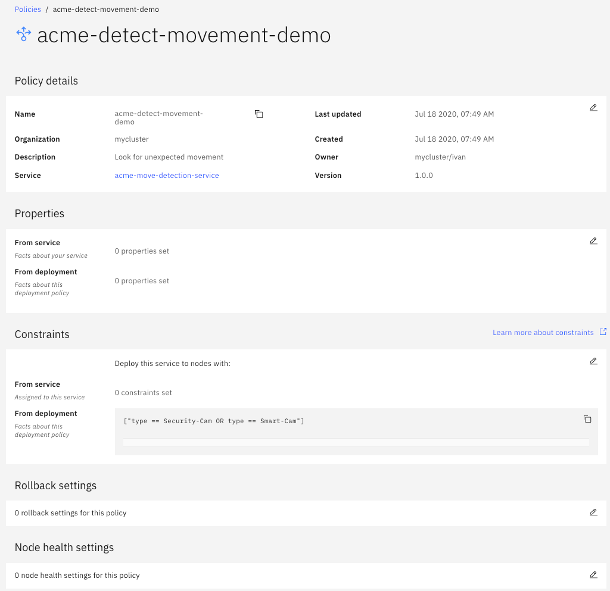

# IBM Edge Application Manager Example Simple Policy Tour Demo


[Box note](https://ibm.ent.box.com/notes/639589210072)

[Demo environment](https://cloudcontent.mybluemix.net/cloud/garage/dte/producttour/ibm-edge-application-manager-workload-management)


<dl>
  <dt>Demo video</dt>
  <dd>IBM Edge Computing demo.</dd>
<a href="http://www.youtube.com/watch?feature=player_embedded&v=Sjmi6wqlIc0
" target="_blank"></a>
</dl>

## 1. Introductions

[IEAM Welcome Page](https://icp-console.ieam41-w3-8e873dd4c685acf6fd2f13f4cdfb05bb-0000.us-south.containers.appdomain.cloud/edge/start)

Hello, I am ____`<your-name>`____ wtih the **IBM Edge Application Manager** (IEAM) team.

We're going to take you through a demonstration of IBM Edge Application Manager capabilities. 

IEAM provides a highly secure and robust application life-cycle management for literally thousands of edge machines regardless of their hardware and software differences. Our fully autonomous Agents transparently work through firewalls, and allow for continuous operation even when the local network is disrupted, making application deployment both time and cost efficient.


Let's take a look at how our **policy deployment** feature autonomously controls workload installation and update for devices with differing capabilities in a retail environment. 

We're going to use ACME Grocery -- a fictional nationwide grocery chain. Each store has a variety of cameras located in various positions throughout their stores, and they want to use them to monitor for security issues as well as for potential inventory outages.  

See diagram below:


We're going to demonstrate this scenario using a live IEAM management hub.

Let's take a look at the IBM Edge Application Manager (**IEAM**) dashboard for ACME's cameras:

* Go to the IEAM dashboard mock-up

	[IEAM Management Hub](https://icp-console.ieam41-w3-8e873dd4c685acf6fd2f13f4cdfb05bb-0000.us-south.containers.appdomain.cloud/edge)

## 2. IEAM Management Hub
The **dashboard** resides in the **Management Hub** which can be placed wherever is appropriate (for example, in a public cloud, or a regional data center, or even inside a factory, completely air-gapped from the Internet).

The **dashboard** enables you to see and interact with all of your edge assets in one place, regardless of their physical locations or current connection status. These edge machines may be geographically distributed or concentrated in one location. The **Agents** on these edge machines are fully autonomous, they are able to reach out to the Management Hub through firewalls when needed. They also tolerate unreliable and intermittent connectivity to the Management Hub.


Notice the dashboard has four tabs: **Nodes**, **Services**, **Patterns** and **Policies**. 

Let's take a look at the **Nodes** tab first:

* Go to the `Nodes` tab

	[IEAM Management Hub](https://icp-console.ieam41-w3-8e873dd4c685acf6fd2f13f4cdfb05bb-0000.us-south.containers.appdomain.cloud/edge)
	
The **Nodes** represent your edge machines -- either edge devices, like an intelligent camera, or edge clusters, like a computer appliance, or a rack of computer blades.

Here you can view and interact with your nodes. It will show all of your registered devices, their assigned software and their last reported status.

Notice that what you are looking at is the **graphical**  node summary. You can also view your edge nodes as a **list**.

* Go to the `List` view:

	[IEAM Management Hub](https://icp-console.ieam41-w3-8e873dd4c685acf6fd2f13f4cdfb05bb-0000.us-south.containers.appdomain.cloud/edge)

The **list** view shows additional details that are not visible in a graphical layout, like **node owner** and last **heartbeat**. If you select an individual node in the list view you can see even more details about the node.

Let's start by finding our cameras.  We have two of them currently registered with this system, but typically you would expect to see hundreds of them deployed across all of ACME's different stores. 

* Go to the **ACME CAM-A** node

## 2.1 CAM-A details

Enter "acme" in the Find bar, and Click on **CAM-A**


	
	

Notice **CAM-A's** current configuration of **properties** and **constraints**. 
These **properties** and **constraints** comprise this node's **policy**, and enable this node to identify its capabilities and highlight its differences. When combined with other policies, it will also inform the type of workloads it will run.

Within the properties of **CAM-A** we see that it identifies itself with `type=Security-Cam` and `GPU-enabled=false` (the latter is used here to indicate that this camera does not contain a video processing accelerator). This camera will only be able to run simple detection workloads, and not deep video analytic workloads. 


Nonetheless, **CAM-A** is centrally positioned so it can be used for either security monitoring or inventory checking. This has been indicated with the constraint of `purpose == security-monitoring OR purpose == check-stock`.

Notice no edge services are running on the Dev node.
	
Next, let's explore **CAM-B** settings:

## 2.2 CAM-B details

* Go to the **CAM-B** node
* [Click: the <back-button> and re-enter "acme" in the Find-bar, select **CAM-B**]


**CAM-B** identifies as:

`type=Smart-Cam` 

and 

`GPU-enabled=true`

**CAM-B** has a video processing accelerator which means it will be able to run many types of workloads. But it is located near an end-cap and so we want to constrain **CAM-B** to only ever being used for checking inventory, Therefore it has a constraint of `purpose == check-stock`.


Like **CAM-A**, note that currently there are no services running on this node.

Now let's learn about edge **services**: 

# 3. Service & Deployment Policies

`(Describe the steps to get to the Services tab)`

* Go to the `Services` tab `(via Node or Home links)`

	[IEAM Welcome Page](https://icp-console.ieam41-w3-8e873dd4c685acf6fd2f13f4cdfb05bb-0000.us-south.containers.appdomain.cloud/edge/start)
	
An IEAM edge **service** can contain one or more **Docker** container images. A group of  one or more **services** together can create an **application**.


The `Services` tab lists all the available services that have been published into the **IEAM Exchange** (to make them available for deployment to your edge nodes).


Let's find the service with the ID: `acme-move-detection-service`. 

Let's use the search bar.

`(Describe the steps to open the tile for this service).`


* Click in `Find services`
* Select to search by `Service ID` in the popup menu
* Select `acme-move-detection-service` in the popup menu 
* Select the `acme-move-detection-service` tile


Notice `acme-move-detection-service` current configuration of **properties** and **constraints**. 

These properties and constraints comprise this service's **policy**, and enable this service to identify its purpose and any specialized requirements it may have. When combined with other policies, it will help to determine on which edge nodes this service will run.

Within the properties of `acme-move-detection-service` we see that it identifies itself with `purpose=security-monitoring`. 

The `acme-move-detection-service` also states a **constraint** that it requires at least `200 MB` of memory. The IEAM Agent automatically provides node properties that identify the amount of memory on the node, so this type of constraint can be used even without manually setting any node properties. 


Now let's look at deploying this software onto some edge nodes. 

## 4. Deployment policy : CAM-A

* Click at the bottom of the screen to jump down to the `Deployment` section

Notice that there are currently no **deployment** polices for this service. Let's create one.

`(Describe steps to create, name and describe a new deployment policy).`


* Click: `Create deployment policy`
* Click in the `Enter a name` field and give it a name of: **acme-detect-movement-demo**
* Click in the `Create a description for your policy` field and write **Look for unexpected movement**
* Click: `Next`


Now let's consider which nodes should run this workload.  This is done by adding **constraints** which must be valid on all devices that need to run this service. These **constraints** are logical expressions that that are evaluated against the **properties** in each node's **policies**.

Create a **constraint** that states the node's `type` property must be equal to `Security-Cam` or `Smart-Cam` in order for this service to be run on the node.


Update **policy** values with:

```
	{
     	"constraints": [
    		"type == Security-Cam OR type == Smart-Cam"
  		] 
    }
```
 `(Describe the steps)`
`[Under "What is this?" enter Property Name = "type",  Operator = "is equal to", and Value = "Security-Cam", press "+", change the conjunction to "OR", and enter Property Name = "type" , Operator = "is equal to", and Value = "Smart-Cam". ]`


* Normally click `Add constraints` at top left, but here, click `Next` at top right
* Click `Enter Property Name`, enter `type`
* Click `Select an Operator`, select `is equal to`
* Click `Enter Property Value`, enter `Security-Cam`
* Click `+` and change the conjuction to `OR`
* Click `Enter Property Value`, enter `Smart-Cam`

In effect, we could have achieved the same result by specifying no constraint at all, but keeping in mind that we may introduce new cameras with other purposes in the future, it's probably better to at least constrain this service with what we do know now. 

Note that properties can have any names and values you wish that are appropriate for your circumstances. And similarly, **constraints** can refer to any **properties** you have set, and you can specify conditions for the values of those **properties** using the wide variety of operators provided.

* Click `Next` at top right

The next screen is for the `rollback` feature, which we will not be using here.

* Click `Next` at top right

Let's review this `policy` and activate it using the `deploy service` button:

* Click `Deploy service` at top right

Make sure this deployment policy looks as follows:



## 5. Agreement negotiations

Once the **service deployment** is saved, then things will begin to happen autonomously in the background. Your autonomous Agreement Robots (**AgBots**) in the **Management Hub** will notice this policy and will begin negotiations with your autonomous **Agents** on each of your registered edge nodes to suggest that those **Agents**  should consider running the associated service workload. 

`[NEED MORE FILLER MATERIAL]`
`(Describe this CAM-A policies diagram while agreement negotiations are completed)`


Each **Agent**  will then evaluate the **AgBot's** proposal based on its local **policy** and will decide whether or not it is appropriate to accept the **agreement** and begin validating the workload, and eventually, if appropriate, to run the workload.

Now move back to the `Nodes` tab to watch this service being deployed. 

`(Describe steps, and show service start running on CAM-A but not on CAM-B)`


* Click `Next` at top right
* Click on **CAM-A**, look at services
* Click on **CAM-B**, look at services


## 6. Deployment policy : CAM-B


Let's return to the `Services` tab in the browser and review another **service**.

Search for the `acme-empty-detection-service` service.

* Click on the `nodes` the upper left corner
* Click on the `Service` tab
* Click in `Find services`
* Select to search by `Service ID` in the drop down menu
* Select `acme-empty-detection-service` in the drop down  menu
* Select the `acme-empty-detection-service` tile

Note the **service** properties section for this newly published service.


Note the service **properties** section for this newly published service. Specifically, this service was built with the purpose of doing **check-stock**. Further, looking at the **constraints**, it requires **500MB** of memory, and  **GPU-enabled** camera.

* Click at the bottom of the screen to jump down to the `Deployment` section

Note also that there is no **deployment** policy. Like before, let's create one. 

(Describe the steps)
`[Click: "Create deployment policy"]
[Enter "Check Shelves" as the name of the policy, and give it a description of, "Check for empty product shelves."]
[Press Next]`


* Click: `Create deployment policy`
* Click: `Next`
* Click in the `Enter a name` field and give it a name of: **acme-check-shelves-demo**
* Click in the `Create a description for your policy` field and write **Check for empty product shelves**
* Click: `Next`

This workload requires a video processing accelerator in order to perform adequately, which has already been declared by the developer of the service. But, specifically, the store wants to ensure this is only run on cameras designated for checking inventory, and so we will create an additional **constraint** of `type == Smart-Cam`.

```
"constraints": [
    "type == Smart-Cam"
  ]
```
* Click: `Next`

Again, we are skipping the `rollback` feature.

* Click: `Next`

Review the new `policy` details before deploying the **service**.


* Click: `Deploy service`

Verify this deployment policy is configured as follows:


Now move back to the `Nodes` tab to watch this `service` being deployed. 

`(Describe steps, and show service start running on CAM-B but not on CAM-A)`

* Click `Next` at top right
* Click on **CAM-B**, look at services


Notice that it is not deployed to **CAM-A** because this service requires the `GPU-enabled` property to be `true`.

* Click on **CAM-A**, look at services


`[Note: you may have to stall and refresh the screen over several mins waiting for the agreement to get formed.]`

See how the service is automatically deployed to camera-B.


`[Note: you may have to stall and refresh the screen over several mins waiting for the agreement to get formed.]`


`[NEED MORE FILLER MATERIAL]`


`(Describe CAM-B Policies)`


## 7. CAM-A Upgrade

Now, let's consider the case where **CAM-A**has been updated with a video accelerator (**GPU**). We need to reflect on that change in the node **policies**. That may occur automatically at the camera. Or we can make that change manually through the IEAM admin console. 

We'll update its node **properties** to change `GPU-enabled` to `true`.  And with that, we can now classify this camera as a `type=Smart-Cam`.


* Click the Node *Properties* edit pencil icon
* Select `GPU-enabled=false` & change it to `true`
* Update `type=Smart-Cam`
* Click on **Done**

Update **CAM-A** property values:

```
   {
     "name": "GPU-enabled",
     "value": "true"
   },
   {
     "name": "type",
     "value": "Smart-Cam"
   }
   
```

Now that it is capable of running the `acme-empty-detection-service` software, **IEAM** will automatically detect that change and negotiate a new agreement with the camera. 


With that you will see the current agreement terminate, and new agreements formed to place both the `acme-move-detection-service`  and the `acme-empty-detection-service`  software deployed on to **CAM-A**.

`Filler time`

`(Describe  **CAM-A** upgrade policies`


* Move back to the `Nodes` Tab
* Select **CAM-A**
* Make the two policy changes above (property and constraint)
* Review and update the node **policy** for **CAM-A**


Let's go back to the `Nodes` tab to observe **CAM-A**


* Again click the `Nodes` tab, select **CAM-A** to watch the results

Notice that **CAM-A** is now running both service workloads.


* Again click the `Nodes` tab, select **CAM-B**


Notice that  **CAM-B** is still running just the `acme-empty-detection-service`  workload - remember that due to its location we wanted to restrict it to only that purpose.


## 8. Summary


Today you have seen the **IBM Edge Application Manager** in action, performing autonomous application lifecycle management on a few example edge machines with hardware and software differences. You have watched our fully autonomous **Agents** work behind the scenes to autonomously manage workload installation and update for devices with differing capabilities in a retail environment. You have also heard that **IEAM** supports very large deployments of many thousands of edge machines.


You have seen that once you have deployed and configured our **Agent** on your machines, you will be able to use **IBM Edge Application Manager** to update policies to change what software runs on which edge machines. You will do this without ever again having to directly connect to any of those machines. Instead you will simply express your intent through our policy mechanism. The **IEAM** system will then work in the background to bring your entire fleet of node into compliance with your policies. This will save your operations team time and money. It will reduce risks from human error, and reduce the complexity of managing your entire fleet of edge machines.


Let's recap what you've just seen by looking at this diagram: 

[IEAM Policies](https://www.ibm.com/support/knowledgecenter/en/SSFKVV_4.1/devices/using_edge_devices/policy_user_cases.html)


There are three sets of **policies**:

- **Node policies** express the properties and constraints of the device or clusters
- **Service policies** express the properties and constraints of the software (the service)
- **Deployment policies** express the properties and constraints of how you want to run your institution

**Deployment policies** inherit and extend the **service policies**. 

Whenever any of these policies are set or changed, **IEAM** will automatically evaluate them to make a decision about where to place the software. In this way, the system can operate at massive scale, and will automatically adjust to changing conditions. 

At this point, we can drill in deeper, we can arrange to get you **hands-on access** to the product, or discuss use cases and how to apply them to solving your business problems. 

**Where would you like to go next with this?** 